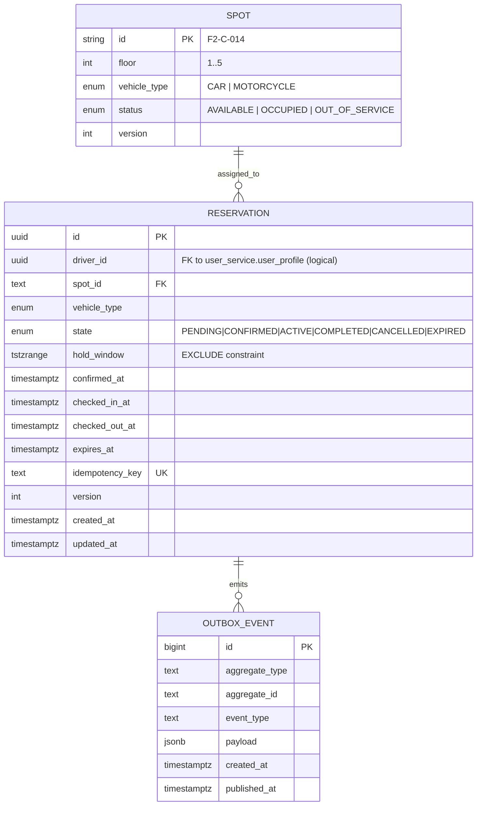

# Entity Relationship Diagram — reservation-service



## Indexes & constraints

```sql
CREATE INDEX idx_reservation_driver_state ON reservation(driver_id, state);
CREATE INDEX idx_reservation_expires_at   ON reservation(expires_at) WHERE state='CONFIRMED';
CREATE UNIQUE INDEX uq_reservation_idem   ON reservation(idempotency_key) WHERE idempotency_key IS NOT NULL;

ALTER TABLE reservation ADD CONSTRAINT no_overlapping_reservation
  EXCLUDE USING gist (spot_id WITH =, hold_window WITH &&)
  WHERE (state IN ('CONFIRMED','ACTIVE'));

CREATE INDEX idx_outbox_unpublished ON outbox_event(created_at) WHERE published_at IS NULL;
```

## Cross-service references

`reservation.driver_id` is a *logical* foreign key to `user_service.user_profile.id`.
We do not enforce it with a real FK because the two services own distinct databases
in production. Integrity is enforced at the application boundary: reservation creation
calls `user-service.GetUserById` to validate the driver exists.
